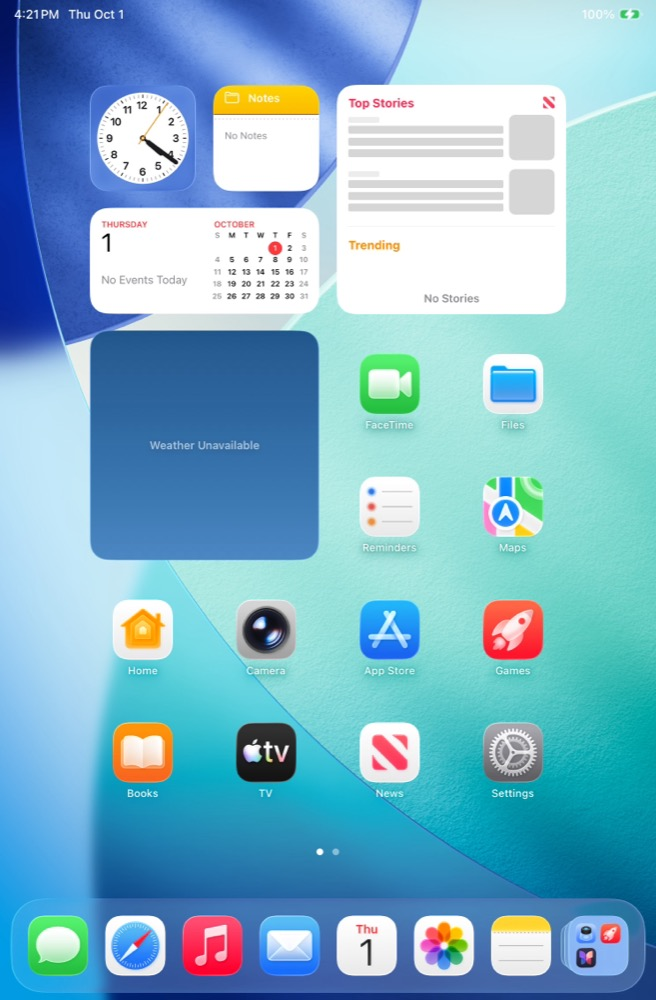

# iPadOS guests

[Documentation](../README.md) · [Create and Run](create-and-run.md) · [Compatibility](compatibility.md)

A vphone VM can run iPadOS instead of iOS. Nothing about the virtual hardware
changes: the boot chain, kernel, SEP and device tree still come from the PCC
cloudOS IPSW (`vresearch101ap` / `vphone600ap`). Only the userland comes from a
different restore IPSW, an iPad's instead of the iPhone17,3's, and the device
tree is rewritten so that userland sees an iPad.



## Supported devices

| Product | Model | Board | Panel | Points @2x |
| --- | --- | --- | --- | --- |
| `iPad16,1` | iPad mini (A17 Pro) | J410AP | 1488x2266 @ 326 ppi | 744x1133 |
| `iPad15,7` | iPad (A16) | J481AP | 1640x2360 @ 264 ppi | 820x1180 |
| `iPad15,3` | iPad Air 11-inch (M3) | J607AP | 1640x2360 @ 264 ppi | 820x1180 |
| `iPad15,5` | iPad Air 13-inch (M3) | J637AP | 2048x2732 @ 264 ppi | 1024x1366 |
| `iPad16,3` | iPad Pro 11-inch (M4) | J717AP | 1668x2420 @ 264 ppi | 834x1210 |
| `iPad16,5` | iPad Pro 13-inch (M4) | J720AP | 2064x2752 @ 264 ppi | 1032x1376 |
| `iPad17,1` | iPad Pro 11-inch (M5) | J817AP | 1668x2420 @ 264 ppi | 834x1210 |
| `iPad17,3` | iPad Pro 13-inch (M5) | J820AP | 2064x2752 @ 264 ppi | 1032x1376 |

The cellular models (`iPad16,2`, `iPad15,4`, `iPad15,6`, `iPad16,4`, `iPad16,6`,
`iPad17,2`, `iPad17,4`) share their Wi-Fi twin's IPSW and run as it: the VM has
no baseband. `iPad15,8` ships in an IPSW of its own without the Wi-Fi board and
is not supported.

Most iPad IPSWs cover several models — the iPad Air and iPad Pro IPSWs carry
both sizes. Without `--device`, `fw prepare` takes the first model the IPSW
lists (the 11-inch); pass `--device iPad17,3` to `fw prepare` or `vm create` for
the 13-inch. Launchpad's New Machine passes the model chosen under **Device**;
with **Custom IPSWs** it takes the first.

Adding another iPad takes one line in `VPhoneGuestDevice`: its product type,
board and panel. Everything the device tree needs is read from the board's own
`DeviceTree.<board>.im4p` in the IPSW.

## Create one

Pass the iPad restore IPSW where the iPhone one would go. The cloudOS is the
same one an iPhone guest of that release would use. `fw catalog` lists every
supported iPad's iPadOS releases with that cloudOS, and `fw catalog --device
iPad16,1` lists one iPad's. With `--device` and no sources, `vm create` offers
that iPad's releases to choose from.

```sh
vphone-cli vm create ipad-mini \
  --iphone-source 'https://updates.cdn-apple.com/2026SummerFCS/cf7db64d-5866-4bf2-bfff-50a32f58bec3/iPad16,1,iPad16,2_26.6.2_23G90_Restore.ipsw' \
  --cloudos-source 'https://updates.cdn-apple.com/private-cloud-compute/c0ecdb4b310cf5239ab2b248dd3098eec297dc5aa3bbe6ada27273262b0b8b64'

# The 13-inch iPad Pro (M5), from the IPSW that also carries the 11-inch
vphone-cli vm create ipad-pro-13 --device iPad17,3 \
  --iphone-source 'https://updates.cdn-apple.com/2026SummerFCS/<…>/iPad17,1,iPad17,2,iPad17,3,iPad17,4_26.6.2_23G90_Restore.ipsw' \
  --cloudos-source 'https://updates.cdn-apple.com/private-cloud-compute/c0ecdb4b310cf5239ab2b248dd3098eec297dc5aa3bbe6ada27273262b0b8b64'
```

`fw prepare --device iPad16,1 --list` lists the iPad's downloadable IPSWs,
and `--device iPad16,1 --iphone-version 26.6.2` resolves one.

In Launchpad, choose **New Machine**, pick the iPad under **Device** and an
iPadOS release under **iPadOS**; the recommended cloudOS comes with it. For an
IPSW that is not in the catalog, set **Source** to **Custom IPSWs** and put the
iPad IPSW in the **iPhone IPSW** field and the cloudOS IPSW in the other. The
Core Bundle in use must include iPad support; the **Device** menu appears only
with a Core Bundle whose catalog lists iPads. `vphone-launchpad-cli vm create
<name> --device iPad16,1` does the same from a terminal.

The manual stages are the same as for an iPhone guest (`vm new`,
`fw prepare`, `fw patch`, DFU + `restore`, `cfw install`, `vm launch`).
Only `fw prepare` and `fw patch` differ for an iPad; DFU, `restore` and
`cfw install` run unchanged.

## What changes for an iPad

- **`fw prepare`** recognises the IPSW from its `SupportedProductTypes`, takes
  the erase identity and `DeviceMap` entry for the guest's board (an iPad IPSW
  covers several), and records the product type and the iPad's display in the
  VM's `config.plist` (`guestProductType`, `screenConfig`). The restore tree
  is named `iPhoneOS_iPad16,1_<version>_<build>_Restore`; the `iPhone` prefix
  is the restore-tree convention every reader matches, not the device.
- **Two device trees.** The hybrid manifest normally points `DeviceTree` and
  `RestoreDeviceTree` at the same vphone600 file. For an iPad, `DeviceTree`
  points at a copy, `Firmware/all_flash/DeviceTree.vphone600ap.guest.im4p`.
  Restore boots the untouched identity that `restored_external` checks against
  the manifest (`iPhone99,11`); the guest boots the copy.
- **`fw patch`** gives that copy the iPad's identity and presentation (patch
  set `devicetree`, entries `devicetree-cfw-ipad_*`):
  - root `model`, `target-type` and `target-sub-type` as on the board (for the
    iPad mini `iPad16,1`, `J410`, `J410AP`), and `compatible` with the board
    first and `VPHONE600AP` kept second;
  - `/product`: the board's artwork idiom, subtype and scale, product name,
    chrome, camera and button geometry, multitasking capabilities
    (`medusa-overlay-app-capability`, `ui-floating-live-app`, `ui-overlay-app`,
    `ui-pinned-app`, and `disable-chamois` where the board has no Stage
    Manager), and its product type and unique model — all read from the
    board's `DeviceTree.<board>.im4p`, which the restore tree keeps;
  - phone-only `syscfg` placeholders (Dynamic Island, reachability, ringer
    switch, volume-button geometry, CarPlay, Watch pairing) are removed.

  The virtual hardware keeps its vphone600 description: GPU feature set,
  framebuffer, memory class and boot flags.
- **LLB** gets one more patch on an iPad guest, `llb-cfw-display_scale`. LLB
  fills `/chosen/display-scale` from the paravirtual display's boot video
  word, which always says 3x; MobileGestalt turns that property into the
  screen scale, so an iPad would get a 496x755-point canvas. The patch makes
  LLB write the iPad's own scale (2x, 744x1133 points).
- **`cfw install`** leaves the installed device tree alone. The iPhone17,3
  post-restore identity rewrite (`preboot-exp-devicetree_identity`) is skipped
  on an iPad guest.
- **The VM window** follows `screenConfig`, so it opens at the iPad's aspect
  ratio.
